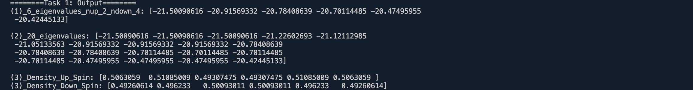

# `task1.py`脚本中各个函数的作用解释

以下将详细解释代码中每个函数的作用和实现细节。

---

## 1. 函数 `cnt_particles_before(state, site, spin)`

**作用**：  
计算在给定量子态 `state` 中，指定的 `site` 和 `spin` 之前存在的粒子数（即占据态的个数）。在费米子体系中，应用产生和湮灭算符时，由于反对易关系，需要考虑符号因子，该函数用于计算该符号因子。

**参数**：

- `state`：整数，表示量子态，使用比特位编码粒子占据情况。
- `site`：整数，表示格点位置。
- `spin`：整数，表示自旋方向，`0` 表示自旋向上，`1` 表示自旋向下。

**实现细节**：

- 计算比特位置 `pos = 2 * site + spin`，因为每个格点有两个自旋状态。
- 创建一个掩码 `mask = (1 << pos) - 1`，其在 `pos` 之前的位都是 `1`。
- 使用按位与操作 `state & mask` 获取 `pos` 之前的所有比特位。
- 使用 `bin()` 和 `count('1')` 计算这些位中值为 `1` 的个数，即粒子数。

---

## 2. 函数 `cnt_particles(state, site, spin)`

**作用**：  
检查在给定量子态 `state` 中，指定的 `site` 和 `spin` 是否有粒子占据。返回 `1` 表示有粒子，`0` 表示无粒子。

**参数**：

- 同函数 `cnt_particles_before`。

**实现细节**：

- 计算比特位置 `pos = 2 * site + spin`。
- 通过移位和按位与操作 ` (state >> pos) & 1` 获取指定位置的比特值。

---

## 3. 函数 `create_annihilation_op(site, spin, sites)`

**作用**：  
构建指定 `site` 和 `spin` 的费米子湮灭算符 \( c_{site, spin} \) 的稀疏矩阵表示。该算符用于从状态中移除一个粒子，并考虑了费米子反对易关系的符号因子。

**参数**：

- `site`：格点位置。
- `spin`：自旋方向。
- `sites`：格点总数。

**实现细节**：

- 计算 Hilbert 空间的维数 `dim = 4 ** sites`（每个格点有 4 种可能状态）。
- 初始化一个空的稀疏矩阵 `operator`。
- 遍历所有可能的状态 `i`：
  - 如果在状态 `i` 中，指定位置有粒子，则计算新状态 `j`，其中该粒子被移除。
  - 计算符号因子 `sign = (-1) ** cnt_particles_before(i, site, spin)`。
  - 将算符矩阵的元素 `operator[j, i]` 设为符号因子。

---

## 4. 函数 `create_creation_op(site, spin, sites)`

**作用**：  
构建指定 `site` 和 `spin` 的费米子产生算符 \( c^\dagger_{site, spin} \) 的稀疏矩阵表示。该算符用于在状态中添加一个粒子。

**参数**：

- 同函数 `create_annihilation_op`。

**实现细节**：

- 直接取对应湮灭算符的转置：`create_annihilation_op(site, spin, sites).transpose()`。

---

## 5. 函数 `create_number_op(site, spin, sites)`

**作用**：  
构建指定 `site` 和 `spin` 的数目算符 \( n_{site, spin} \) 的稀疏矩阵表示。该算符用于测量指定位置的粒子占据数。

**参数**：

- 同函数 `create_annihilation_op`。

**实现细节**：

- 利用产生和湮灭算符的乘积：`create_creation_op(site, spin, sites) @ create_annihilation_op(site, spin, sites)`。

---

## 6. 函数 `get_basis(N_up, N_down, sites)`

**作用**：  
生成在 Hilbert 空间中具有固定的自旋向上粒子数 `N_up` 和自旋向下粒子数 `N_down` 的基态集合。

**参数**：

- `N_up`：自旋向上粒子数。
- `N_down`：自旋向下粒子数。
- `sites`：格点总数。

**实现细节**：

- 遍历所有可能的量子态 `state`：
  - 对于每个态，计算自旋向上和自旋向下的粒子数。
  - 如果粒子数匹配指定的 `N_up` 和 `N_down`，则将该态加入基集合 `basis`。

---

## 7. 函数 `construct_hamiltonian(sites, edges, extended_edges, t, U, V, mu)`

**作用**：  
构建扩展 Hubbard 模型的哈密顿量矩阵 `H`。哈密顿量包含以下项：

- 动能项（粒子在邻近格点间的跃迁）；
- 现场相互作用项（同一格点上的相互作用）；
- 扩展相互作用项（不同格点间的相互作用）；
- 化学势项。

**参数**：

- `sites`：格点总数。
- `edges`：邻近格点的边列表，用于动能项。
- `extended_edges`：扩展相互作用的边列表。
- `t`：跃迁能量参数。
- `U`：现场相互作用强度。
- `V`：扩展相互作用强度。
- `mu`：化学势。

**实现细节**：

1. **动能项**：
   - 对于每对邻近格点 `(i, j)` 和每个自旋 `spin`，构建跃迁算符，并将相应项添加到哈密顿量中。
   - 包含 `ci_dagger @ cj` 和 `cj_dagger @ ci` 两项，表示粒子在格点间的跃迁。

2. **扩展相互作用项**：
   - 对于每对扩展相互作用的格点 `(i, j)`，构建数目算符之积，并添加到哈密顿量中。

3. **现场相互作用和化学势项**：
   - 对于每个格点 `i`，计算自旋向上和自旋向下的数目算符。
   - 添加现场相互作用项 `U * (ni_up @ ni_down)` 到哈密顿量。
   - 添加化学势项 `-mu * (ni_up + ni_down)` 到哈密顿量。

---

## 8. 函数 `calculate_expectation_value(ground_state, sites)`

**作用**：  
计算给定基态 `ground_state` 下，每个格点和自旋处的粒子数目期望值。

**参数**：

- `ground_state`：基态向量。
- `sites`：格点总数。

**实现细节**：

- 初始化期望值数组 `exp_values`。
- 对于每个格点 `i` 和自旋 `spin`，计算数目算符 `ni` 对基态的期望值，并存储在数组中。

---

## 9. 函数 `calculate_sub_hamiltonian(H, basis)`

**作用**：  
在给定的 Hilbert 子空间（由态集合 `basis` 指定）中，提取哈密顿量的子矩阵，并计算其最小的几个本征值。

**参数**：

- `H`：完整的哈密顿量矩阵。
- `basis`：Hilbert 子空间的态索引列表。

**实现细节**：

- 构建维度为 `dim = len(basis)` 的子哈密顿量矩阵 `sub_H`。
- 使用 `H[basis[i], basis[j]]` 填充子矩阵的元素。
- 利用 `eigsh` 函数计算子哈密顿量的最小 `k=6` 个本征值。

---

## 10. 函数 `main()`

**作用**：  
主函数，执行以下步骤：

1. 设置模型参数，包括跃迁能量 `t`、现场相互作用强度 `U`、扩展相互作用强度 `V`、化学势 `mu`，以及自旋粒子数 `N_up`、`N_down`、格点数 `sites`。
2. 定义格点间的边和扩展边，用于构建哈密顿量。
3. 调用 `construct_hamiltonian` 构建哈密顿量矩阵 `H`。
4. 获取指定粒子数的 Hilbert 子空间基态集合 `basis`。
5. 调用 `calculate_sub_hamiltonian` 计算子哈密顿量的本征值。
6. 使用 `eigsh` 计算完整哈密顿量的最小 `k=20` 个本征值和对应的本征向量。
7. 取基态（能量最低的本征态），调用 `calculate_expectation_value` 计算每个格点和自旋的粒子数目期望值。
8. 输出计算结果。

以下将详细解释代码中每个函数的作用、实现细节，以及该代码如何利用了 **U(1) 对称性** 来优化计算。

---

## 代码利用 U(1) 对称性的总结

系统的哈密顿量与总粒子数算符对易，意味着在动力学过程中，总粒子数保持不变。对于有自旋的系统，自旋向上和自旋向下的粒子数分别守恒，我们实际上有 U(1) × U(1) 对称性。

- **在代码中的体现**：
  - **`get_basis` 函数**：通过生成固定 `N_up` 和 `N_down` 的基态集合，我们将 Hilbert 空间划分为更小的、不相交的子空间。这大大降低了计算矩阵的维度，使得对角化哈密顿量变得可行。
  - **`calculate_sub_hamiltonian` 函数**：在固定粒子数的子空间中提取哈密顿量的子矩阵，对于粒子数守恒的哈密顿量，这样的子矩阵是对角化的合适选择。
  
- **优势**：
  - **减少计算量**：利用对称性后，哈密顿量的矩阵维度从整个 Hilbert 空间的维度缩小到固定粒子数子空间的维度，显著减少了计算复杂度。
  - **获得更多物理信息**：通过分别研究不同粒子数子空间，可以更清晰地理解系统在不同填充情况下的物理性质。

---

通过以上函数和算法，代码实现了对扩展 Hubbard 模型的数值模拟，包括哈密顿量构建、本征值求解和物理量期望值的计算。在此过程中，充分利用了系统的 U(1) 对称性，提高了计算效率，为深入研究强关联系统的物理性质提供了有力工具。

**程序输出**：

通过以上函数，代码实现了对扩展 Hubbard 模型的数值模拟，包括哈密顿量构建、本征值求解和物理量期望值的计算。
